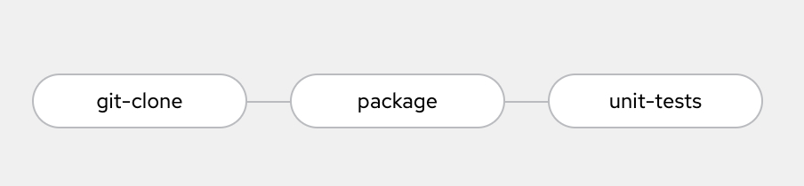
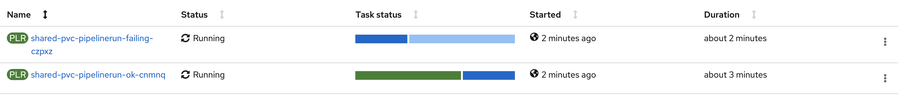
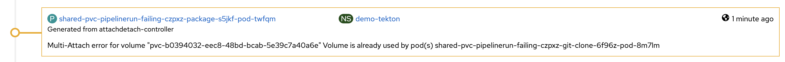
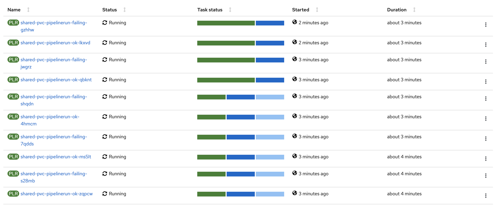
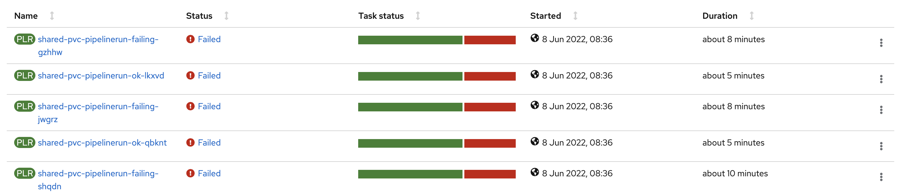
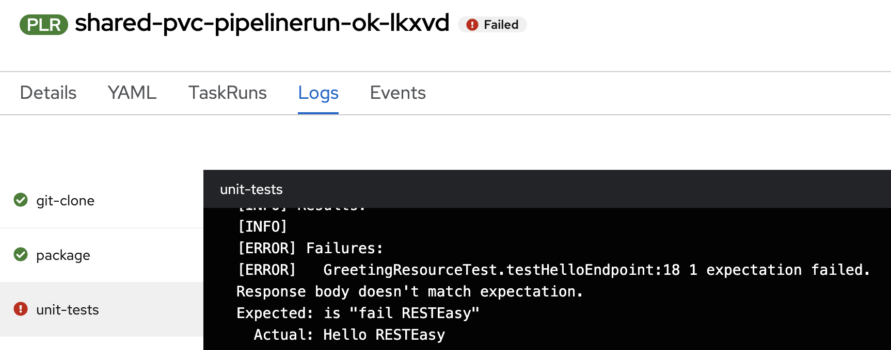
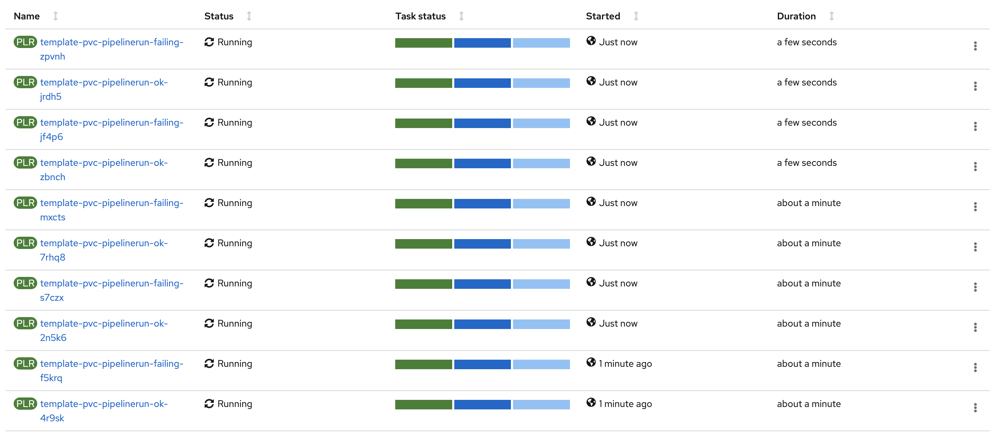
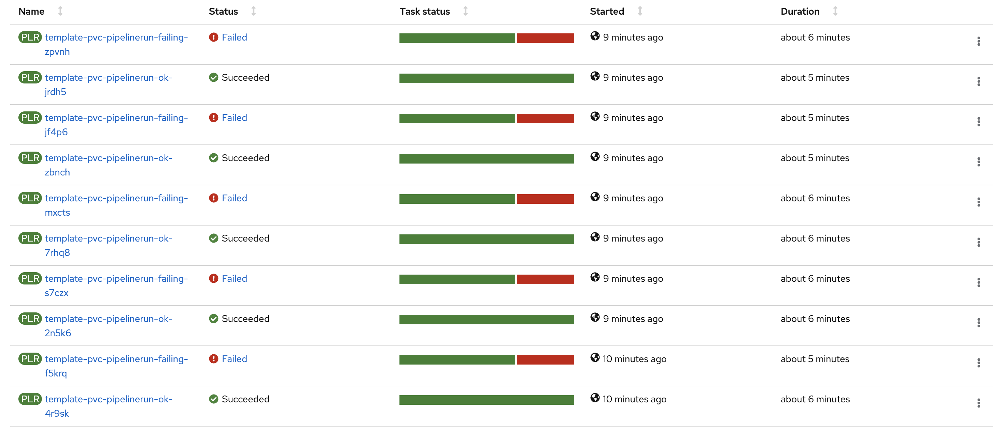
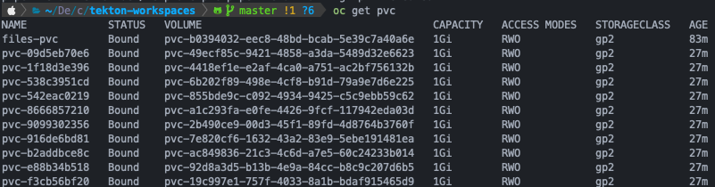
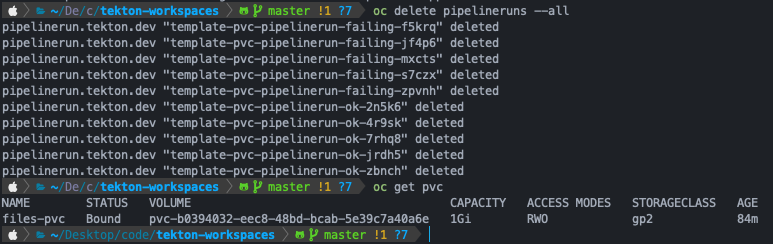

# tekton-workspaces

Repository to test Tekton workspaces concurrency

## 1. Pipeline

- **git-clone**: clones application repository (cleans existing repository if exists).
- **package**: executes `mvn package` command in application folder.
- **unit-test**: executes `mvn test` command in application folder.

## 2. Environment configuration

Execute `install.sh` file to configure environment:
- Create test namespace
- Deploy pipeline operator
- Create PVC for pipelines
- Create test pipeline

## 3. Tests

All tests run the pipelines using two different branches:

- **master**: unit tests are ok
- **failing-tests**: unit tests fail

### 3.1 Shared PVC pipelines

Runs two pipelines in parallel with 30 seconds difference between them and sharing a PVC.

*Run this test using `shared-pvc.sh` file*

Results:

- First triggered pipeline is executed normaly, the second one is waiting on git-clone task.

  

- The reason the second pipeline is waiting is that there is a pod using the pvc

  

- Both pipelines work as expected because the second one did not run until the first one finished

### 3.2 Multiple Shared PVC pipelines

Based on 3.1 test, if pods (tasks) block the claim over PVC that means that secuencial execution on parallel pipelines is not granted (we were 'lucky' in previous test).
This tests executes 10 pipelines in parallel with just 5 seconds difference between them and sharing a PVC.

*Run this test using `shared-pvc.sh` file*

Results:

- Pipelines runs in parallel and taks are executed when they are able to attach the volume (no specific order).

  

- All pipelines failed in `unit-test` task 

  

- The reason is that last repo cloned in the shared volume was the one with the test failing:

  

### 3.3 Multiple Shared PVC pipelines

Runs 10 pipelines in parallel with just 5 seconds difference between them and use a volume template to create independent volumes.

*Run this test using `template-pvc-many.sh` file*

Results:
- Pipelines run in parallel

  

- Pipelines finished as expected

  

- PVC are not deleted after pipelineruns finish

  

- In order to clean the PVC, pipelineruns need to be deleted

  

